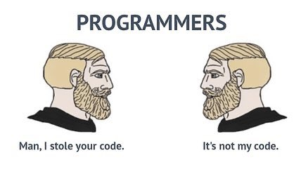

## New Beginnings

Learning is one of the most beautiful things we can do in life. No matter what we do, every 
experience and lesson we encounter has the potential to impact us on a meaningful level, and 
I'll be lying if I said that the past few months of learning has not done that to me. One of my 
greatest joys is applying my various passions into each other. As a photographer, I like to keep 
my workflow simple yet elegant. My camera automatically changes the settings that I want it to, 
and photos are batch editted based on presets I create. It might seem easy, or that I am lazy, 
but this process greatly reduces stress and allows me to spend more time in the moment, and this 
mindset has carried over to my journey as a beginning software engineer.

## Let's Share

In today's world, recycling is very useful, whether it be your cans and bottles or things you 
have previously worked on. Oftentimes people come up with the exact same solution to a problem. 
That is just the nature of it, if the same question is asked then the same answer may be given. 
However, as a computer science student, this concept is admittedly a bit frightening. If my 
classmate and I come up with the exact same code, with the exception of a few lines, would we be 
marked for plagiarism? This fear has been prevalent for the past few computer sciences classes I 
have been enrolled in, but that changed when I learned more about open source software 
development. This concept basically means that an application's source code is readily available 
and is able to be reused. 

My first "real" encounter of this was during my first group project, the [Manoa Organization Database](https://justinjandoc.github.io/projects/manoa-organization-database).
In this project, my group used the open source web application [Bowfolios](https://bowfolios.github.io/), and this greatly sped up development as many of the necessary elements we needed were provided.
Being able to constructively manipulate the resources we already have in order to suit a new 
purpose is a skill that will enable me to work more effectively and will give me a leg up in the 
beginning stages of future projects.

## Keep It Clean (Consistently)

A major part of any project is tidying up, whether it be proofreading and essay, editing a 
client's photos, or removing bugs and errors from code. Cleaning up code is usually not too 
tricky, but sometimes you may run into some spaghetti. Lines and letters meld into each other 
and it becomes a massive hassle having to read. This problem becomes exponentially worse when 
you are working in a group, or if you are trying to read someone else's code. Thankfully, having 
clear coding standards can remedy this. Having this set of rules of how your code should look, 
as well as how to avoid ineffecient implementation, is useful in numerous settings. As a student,
a few of my computer science professors enforced their own coding standard, and they were 
typically very reasonable. If you had to grade douzens of programs and files, you would want 
some consistency within the endless lines. 

The standards used oftentimes come with restrictions, 
but such restrictions only allow for us to further understand why things are restricted in the 
first place. For example, in Javascript you may declare a variable with `const` or `let`.
I prefer to play it safe and use `let` as this allows the variable to be manipulated after it is 
initialized. However sometimes there is no point in this, and this may also cause issues if I 
mistakeningly tamper with the variable in ways I did not intend to. This is where `const` comes 
into play, as if a variable is declared using `const`, nothing can change it. Having a set 
standard for myself, and perhaps any team I work with in the future, will allow for us to have a 
greater understanding of our own work and do what needs to be done in a timely manner. 

## Allow Patterns

My workflow is very optimization focused. If I am able to create a solution and use that 
solution again and again, I will take that opportunity. In computer science many problems 
occurs, so generic solutions are created in order to be followed so that these problems may be 
solved. These are called design patterns, and such a concept occurs in other fields. Take 
photography, for example. When you are taking a photo, you would typically want the subject to 
be centered. However, this changes as the subject changes. If you are taking a picture of the 
sunrise, consider letting the sky fill the top two thirds of the frame. If you are taking 
pictures of a CEO of a company, consider taking pictures from a lower angle to simulate their 
position at the top. Photography has the basically rule called the [rule of thirds](https://digital-photography-school.com/rule-of-thirds/)
, and knowing when to apply or tweak it has helped me to achieve some of my best shots. 

When it comes to software development, I also try to find the most optimal solution and apply 
tweaks to it. A certain design pattern that I have personally gravitated to is the prototype 
design pattern. This design pattern has an initial instance ready to be copy and cloned. This 
allows for the clones to be individually manipulated, and this style of solution seems very 
versatile. For example, when editting photos, I like making a preset of edits done to a single 
picture. I can then batch edit the remaining pictures and apply tweaks afterwards if needed. 
Being aware of this concept of predefined solutions and patterns will allow for me to try a 
similar approach to any future projects.

## What Now?

Looking back to the past few months, I have learned so much and further enforced what I have 
already known. My workflow can now be further refined, and I am eager to see what else I can 
learn. Looking ahead, I am curious as to what opportunities may occur that will enable me to 
apply my knowledge acquired from my passions.
