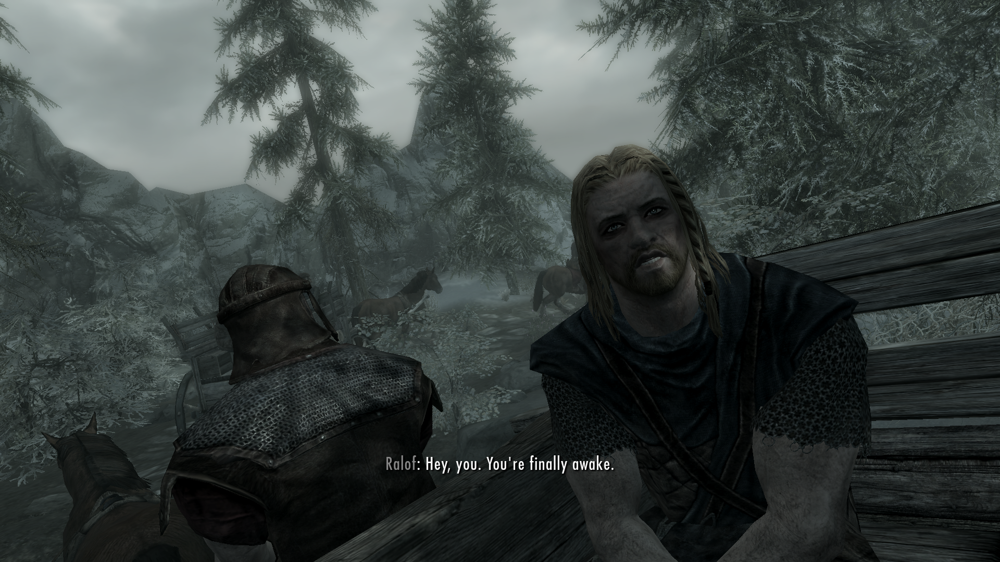
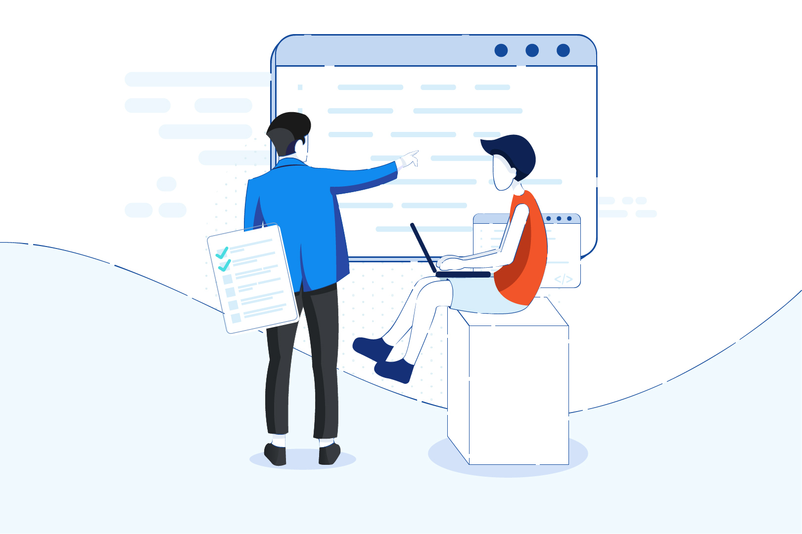
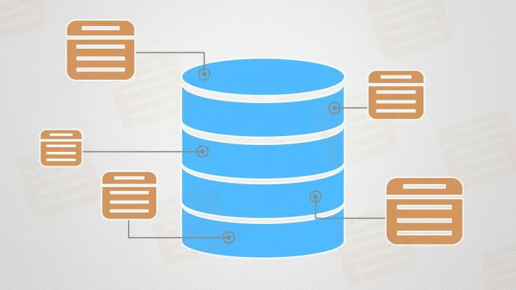

For more information and context regarding the project I will be reflecting on, please read the [Manoa Inventory: POST](https://justinjandoc.github.io/projects/manoa-inventory-post) project write up.

## Weren't We Just Here?

About a year ago, I took a classes called ICS314: Software Engineering I. I enjoyed the class, and when I heard of the continuation class, ICS414: Software Engineering II, I decided to register and take this class during the Spring 2023 semester. When the semester started, I found myself in the same room I took ICS314 with the same professor and used the same IDE with the same language. It was great, I was excited to get back into software engineering and to meet more people within my major. We were told that we will be creating a web application for our clients, and it is to be used to catalogue the inventory and people located on the third floor of POST. After a few group discussions, we decided on the name Manoa Inventory: POST.

## Reviewing

As it was a few months ever since I last touched Javascript, I felt very out of practice. Thankfully, we were assigned multiple code reviews in which we reviewed ICS314 code and commented what we may change. We were also tasked to review our own code in order to determine if it was up to our standards. This practice helped me to make sure that my code met our standards, was readable, and worked properly.

Alongside our code reviews, we also reviewed ourselves. During the start of the semester we were asked to create three SMART goals, with mine being "become better at working in a team", "manage my time better", and "write code more thoughtfully." Throughout the semester, we wrote reflections and gave progress reports. Here at the end of the semester, I think that I have made considerable progress with each of my goals, but I know I can always do better.

## New Focus

During my first project I focused on the frontend and the user interface, but this time I decided to focus on the backend and the database. Last semester I took some courses that covered databases and, because of how rusty my Javascript was, I felt more comfortable working on the collections rather than the pages. Thankfully my teammates filled in the gaps I left, and at the start of the project when I told them that I am more comfortable working on the collections, one of them said that they can pick up where I left off when it came to the page I was working on.

There were times that the project was not going as smooth as it could be, but we made it through in one piece. I think that my teammates did a really great job and that they should be proud of themselves. For what it's worth, I liked the course and had some fun, as I genuinely enjoy programming and writing code. This project class has given me valuable experience when it comes to working for a customer, as well as insight as to how it feels like to work in a larger team. Although my team and I feel like we could have done a bit more with the project, I am happy with our final product and with the experiences that we shared.