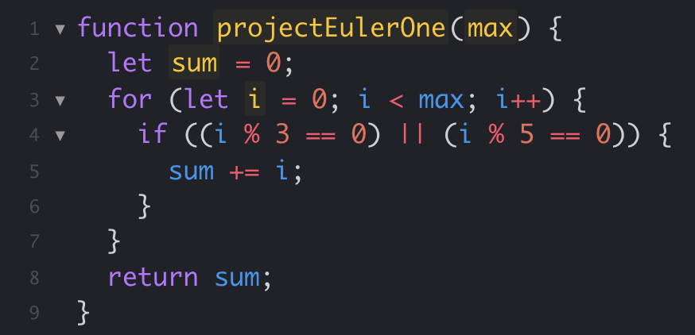

## An Old Obsession

One of the greatest joys in my life is becoming comfortable with a new skill or passion. A few of my personal interests are photography, skating, and keyboards. Very few things feel more exhilarating and freeing than when I am able to geek out and dive deep into the rabbit holes that each interest provides. The deeper down in the rabbit hole I go, the more I find myself wanting to obsessively optimize. This mindset of finding the best cases via optimization has accompanied me when I started learning about software engineering and writing code. 

## A New Opportunity

The first programming languages I have learned were Java, C, and C++. Transitioning from Java to C to C++ went pretty smoothly. When I heard that my next class, Software Engineering, would cover Javascript, I became very excited. Up until now, C++ was my preferred language. It might be biased since it is the most recent programming language I have learned, but I felt comfortable and like I could optimally write with it. I greatly enjoy adding more to an interest and putting it into photography terms, learning Javascript is just like adding another lens to my kit. For me personally within this first week of learning and writing with Javascript, in photography terms, C++ is a lens with fixed focal length whereas Javascript is a zoom lens.

The first Javascript concept that made me genuinely giddy to learn more about this programming language is how variables are handled. Within C++, you would have to declare that a variable is the data type that you want it to be. Depending on the mindset of the user, this may not even be seen as a restriction. However, within Javascript, instead of the user having to manually tell the code which data type they want variables to be, the code just automatically assigns the type based on context. Furthermore, Javascript also has switch statements, which I have sorely missed when I transitioned from Java to C. Not having to declare variable types and having another option than filling a program with if-else statements might seem like minuscule things, but these got me excited to learn more about Javascript.

## An Upcomming Obstacle

Throughout my current Computer Science course, Software Engineering, my professor will assign WODs (workouts of the day). I believe that these WODs will prove to be extremely beneficial to me and will help me further optimize and understand the logic that I use to write code. Aside from optimization, the pressure of these WODs being timed allow me to practice managing stressful situations and working under pressure. This style of learning seems like a very efficient way to learn and become accustomed to programming languages, so I am eager to see how much I might learn throughout this course.
