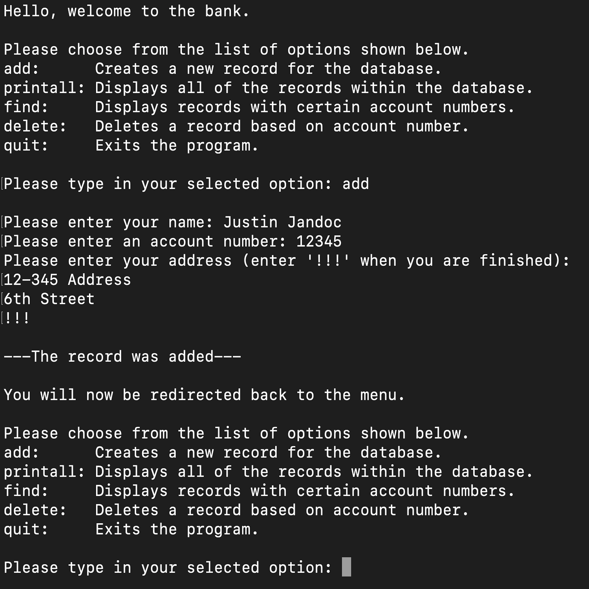

During the Fall 2021 semester, the professor of my ICS212 course assigned this major project. This program simulates a bank database with the functionality of being able to add, delete, and display accounts and records. The first part of the project included the user-interface. The requirement was to create a menu printed out to the user displaying the multiple options. The program must then accept user inputs in order to redirect users to their chosen option. The second part of the project included implementing a linked list storing the accounts and records within the database. The program could also run regularly or with debug outputs declaring which functions are current being called.

```C++      
// user input
std::cout << "Please type in your selected option: ";
std::cin.get(input, 50);
std::cin.clear();
std::cin.ignore();

// checks input
if (strncmp(input, "add", strlen(input)) == 0) {
    add++;
} else if (strncmp(input, "printall", strlen(input)) == 0) {
    printall++;
} else if (strncmp(input, "find", strlen(input)) == 0) {
    find++;
} else if (strncmp(input, "delete", strlen(input)) == 0) {
    del++;
} else if (strncmp(input, "quit", strlen(input)) == 0) {
    quit++;
}
```

Originally, this program was written in C. Partway through the course, the professor reassigned the project but required for the program to be updated into C++. Above is a snippet of my code. This is the part that accepts a user input and then "unlocks" the chosen menu option. The first version of this part was unnecessarily complicated, long, and consisted of many if-else statements. Thanks to the C String functions, I was able to greatly shorten the input conditionals.

I eventually would like to further optimize this project in C++, as well as remake it in other programming languages. It helped give me a beter understanding of data structures, such as linked lists, and enabled me to practice more regarding handling user inputs. The project also allowed me to practice tracing programs in order to see how code runs, watch how values within the program shift, and make debugging an easier experience.

Feel free to click this [link](https://github.com/justinjandoc/Bank-Database) if you are interested in reading the source code.

