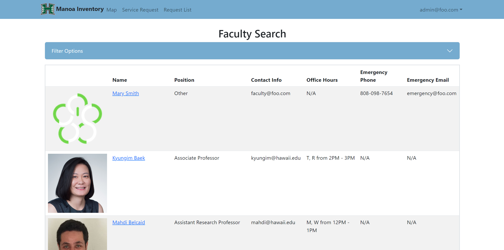
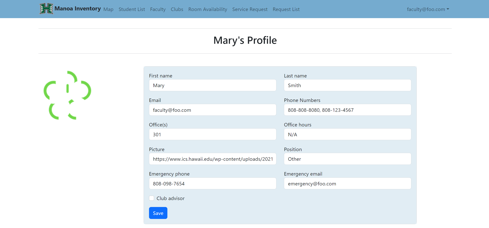

Manoa Inventory: POST, or MI:P for short, is a web application based on the third floor of the Pacific Ocean Science and Technology building. It was developed in order to allow for members of the University of Hawai'i at Mānoa, namely the office workers and IT support, to know who and what may be located on the third floor of POST. The website is filled with information including Computer Science faculty members, relevant clubs, and room information. Users, such as students and faculty, are able to edit their own profiles, view clubs, make service requests, and see the room availability. Admin and office workers are able to edit other users' profiles and change room arrangements.

This group project was assigned by my ICS414, Software Engineering 2, professor during the Spring 2023 semester. I was in a group with seven other people, and my contributions mainly focused on the backend and database. During the project, I created collections to store data from the users, clubs, and rooms. These collections could then be linked to the frontend of the web application, displaying things such as a user's profile information or the rooms they are associated with. Near the end of the project, I focused on adding functionality that allowed faculty members to add their own emergency contact information, which was requested by our customer.

Manoa Inventory: POST was my second software engineering but my first project in which we had to create something for a customer. I was also in a bigger group than what I was used to, but this was offset with the amount of work there was to be done. 
