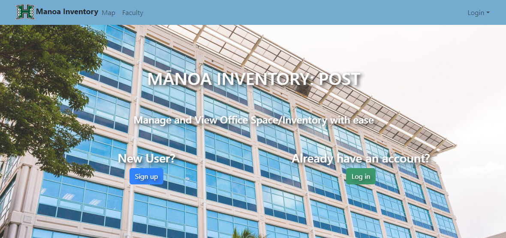

The Manoa Inventory: POST, or MI:P for short, is a web application based on the third floor of the Pacific Ocean Science and Technology building. It was developed in order to allow for members of the University of Hawai'i at Mānoa, namely the office workers and IT support, to know who and what may be located on the third floor of POST. The website is filled with information including Computer Science faculty members, 