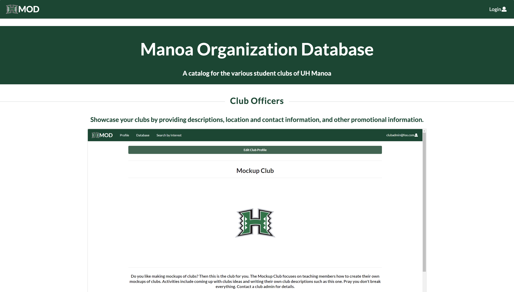

The Manoa Organization Database, or MOD for short, is a web application developed to allow 
members of the University of Hawai'i at Mānoa to easily find and reach out to clubs and other 
organizations based in the univeristy. The web application includes a database filled by a list 
of its users, interests, and clubs. Users are able to edit their profile by changing their 
name, profile picture, interests, and clubs, and club officers are able to edit the information 
regarding their clubs. There is also functionality to search for clubs based on interests.

This group project was assigned by my ICS314 professor during the Spring 2022 semester. My group 
decided to use the Bowfolios web application as a template, and its homepage can be found [here](https://bowfolios.github.io/). 
The group consisted of five people, and my contributions were focused on the user/profile 
portion. I worked on the user homepage, the page which allows users to edit their own profile, 
and I also helped with cleaning up the code so that the web application would be ready for the 
public to use. 

The Manoa Organization Database was my first computer science group project. It allowed me to 
bond more with my classmates, as well as develop the skills to effectively work within a group. 
I gained valuable experience and communication skills, as the group would have frequent 
discussions and we would all equally and fairly contribute during meetings. This project also 
allowed me to have a greater understanding of GitHub and its Project Boards. Before this, I 
would tend to brute force my way through a project and just figure it out as I go, but this 
system of having a to-do list has helped me to slow down, take time to access what I need to do, 
and continue working with a clear mind.

The project homepage can be found [here](https://manoa-organization-database.github.io/), and it 
includes more information on the Manoa Organization Database. You may also find the link to the 
web application on our homepage, but the deployment may not be active.